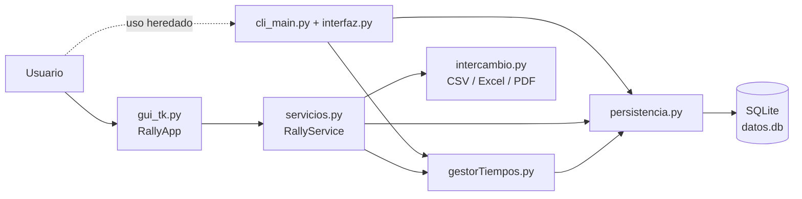
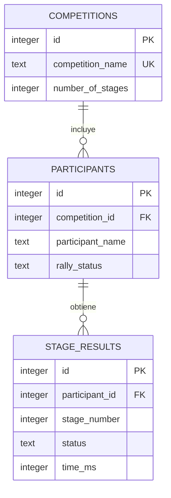

# Arquitectura y modelo de datos

## 1. Visión general

Rally Time Tracker es una aplicación monolítica de escritorio, local y síncrona. Usa únicamente la biblioteca estándar de Python durante la ejecución:

- Tkinter/ttk para la interfaz;
- `sqlite3` para persistencia;
- `os`, `sys` y `ctypes` para rutas e integración con Windows.

No hay proceso servidor, API HTTP, autenticación ni sincronización externa.



La GUI sigue una separación ligera entre presentación, servicios y persistencia. La CLI es anterior a esa separación y llama directamente a persistencia y utilidades.

## 2. Módulos

| Archivo | Responsabilidad | API o elementos principales |
| --- | --- | --- |
| `src/main.py` | Entrada oficial | Importa y ejecuta `gui_tk.main()` |
| `src/gui_tk.py` | Ventana, formularios, tabla, eventos y temas | `RallyApp`, `main()` |
| `src/servicios.py` | Casos de uso, mensajes y validación de dominio | `RallyService` |
| `src/database_schema.py` | Esquema versionado, backup y migración | `initialize_database`, `DatabaseMigrationError` |
| `src/persistencia.py` | Ruta de datos y consultas SQLite | competiciones, resultados, estados y retiradas |
| `src/intercambio.py` | Formato de intercambio y documentos | CSV, Excel, validación de importación y PDF |
| `src/copias_seguridad.py` | Protección de la base | backup SQLite, rotación, validación y restauración atómica |
| `src/gestorTiempos.py` | Conversión de unidades y orden de participantes | `tiempo_a_milisegundos`, `milisegundos_a_tiempo`, `orderParticipants` |
| `src/cli_main.py` | Bucle interactivo de consola heredado | código ejecutado a nivel de módulo |
| `src/interfaz.py` | Menús y tabla de texto de la CLI | `menuPrincipal`, `cargarCompeticiones`, `menuCompeticion`, `mostrarDatos` |
| `.github/scripts/release.py` | SemVer, notas y actualización de changelog | cálculo a partir de commits |
| `.github/workflows/release.yml` | CI de publicación | build Windows, commit, tag y GitHub Release |
| `.github/workflows/tests.yml` | CI de calidad | sintaxis y suite completa en ramas y pull requests |
| `tests/test_release.py` | Regresión del versionado automático | tags, commits, incrementos SemVer, changelog y salidas de Actions |
| `tests/test_validaciones.py` | Validación funcional con SQLite temporal | tiempos, etapas, participantes y penalizaciones |
| `tests/test_funcionalidad.py` | Flujos funcionales con SQLite temporal | ciclo de vida, clasificación completa, abandonos, penalizaciones y lógica de tabla |
| `tests/test_estados.py` | Estados y compatibilidad | transiciones, retiradas, clasificación y migración v1 |
| `tests/test_intercambio.py` | Intercambio de datos | ida y vuelta CSV/Excel, colisiones y PDF |
| `tests/test_copias_seguridad.py` | Backups | creación, rotación, validación, importación y restauración |

Los imports de `src` son imports planos, no un paquete Python instalable. Por eso las entradas se ejecutan como archivos desde `src` y no mediante `python -m rally_time_tracker`.

## 3. Estado de la GUI

`RallyApp` mantiene en memoria:

- `service`: instancia de `RallyService`;
- `current_competition`: diccionario de la competición cargada;
- `current_leaderboard`: filas del ranking original;
- `dark_mode` y `theme_colors`: estado visual;
- `dashboard_window` y `dashboard_tree`: panel operativo opcional del tramo;
- variables Tkinter de formularios y widgets.

No existe caché de dominio. Después de una escritura correcta, la GUI consulta otra vez SQLite y reconstruye la tabla. Si una recarga ya no encuentra la competición seleccionada —por ejemplo, después de borrarla—, `_reset_competition_view` limpia la selección, la clasificación, la cabecera y los controles de acciones.

## 4. Modelo de dominio

Una competición tiene:

- identificador entero autoincremental;
- nombre único;
- número de etapas;
- una lista de participantes y una fecha opcional.

Cada participante tiene un estado general `active`, `retired` o `disqualified`. Cada pareja participante/tramo tiene siempre un resultado explícito `pending`, `finished`, `stage_dnf`, `dns` o `dsq`, con tiempo únicamente cuando corresponde.

El resultado conserva el tiempo anterior, un contador de revisiones y la fecha de actualización. Esto permite detectar modificaciones, aunque todavía no constituye un historial completo.

## 5. Esquema SQLite v2

`PRAGMA user_version` identifica el esquema. Las tablas de dominio usan claves primarias, claves foráneas con borrado en cascada, restricciones únicas, `CHECK`, índices y triggers de rango de tramo.

```sql
CREATE TABLE competitions (
    id INTEGER PRIMARY KEY AUTOINCREMENT,
    competition_name TEXT NOT NULL COLLATE NOCASE UNIQUE,
    number_of_stages INTEGER NOT NULL,
    event_date TEXT
);

CREATE TABLE participants (
    id INTEGER PRIMARY KEY AUTOINCREMENT,
    competition_id INTEGER NOT NULL,
    participant_name TEXT NOT NULL,
    rally_status TEXT NOT NULL,
    retired_after_stage INTEGER,
    FOREIGN KEY(competition_id) REFERENCES competitions(id) ON DELETE CASCADE
);

CREATE TABLE stage_results (
    id INTEGER PRIMARY KEY AUTOINCREMENT,
    participant_id INTEGER NOT NULL,
    stage_number INTEGER NOT NULL,
    status TEXT NOT NULL,
    time_ms INTEGER,
    previous_time_ms INTEGER,
    revision_count INTEGER NOT NULL,
    FOREIGN KEY(participant_id) REFERENCES participants(id) ON DELETE CASCADE,
    UNIQUE(participant_id, stage_number)
);
```

Relación conceptual:



Antes de migrar una base histórica se crea `datos.v1.backup.db`. Los tiempos válidos pasan a `finished`, se consolidan duplicados conservando el último y se generan filas `pending` para el resto de combinaciones participante/tramo. Las incompatibilidades quedan en `schema_migration_log`.

## 6. Ubicación e inicialización

`persistencia._get_db_path()` decide la ruta:

```text
¿sys.frozen?
├── sí  -> %LOCALAPPDATA%/RallyTimeTracker/datos.db
└── no  -> <os.getcwd()>/data/datos.db
```

En ambos casos crea el directorio si falta. Cada función abre una conexión, llama a `database_schema.initialize_database`, ejecuta su operación y cierra la conexión.

La base `data/datos_template.db` existente en algunos entornos es una plantilla vacía histórica. El código actual no la copia ni la consulta. El `.spec` local también la menciona, pero el workflow vigente empaqueta mediante argumentos de línea de comandos y crea la base al primer uso.

## 7. Flujos principales

### Crear competición

```text
Formulario GUI
  -> RallyService.create_competition
     -> normaliza y valida nombre, etapas y participantes únicos
     -> persistencia.add_competition
        -> repite validaciones en el límite de persistencia
        -> INSERT competitions
        -> INSERT participants en la misma transacción
  -> refresco y selección
```

La competición y sus participantes se confirman en una única transacción. Una colisión de nombre revierte toda el alta.

### Registrar tiempo

`RallyService.add_time_str` exige `m:ss.xxx`, segundos entre `00` y `59`, tres milisegundos y duración positiva. `persistencia.add_time` actualiza la fila única participante/tramo a `finished`, conserva el valor anterior e incrementa el contador cuando corrige un resultado ya resuelto.

Las operaciones de abandonos y penalizaciones utilizan el mismo límite de validación. Una llamada directa a persistencia no puede guardar un tiempo decimal, nulo, negativo, fuera de rango o asociado a un participante desconocido.

### Rellenar abandonos

`fill_times` obtiene el mayor tiempo de la etapa y cambia únicamente los resultados `pending` de participantes activos a `stage_dnf` con `peor_tiempo + 10000` milisegundos. El piloto continúa activo en el rally.

### Retirar del rally

`retire_participant` diferencia una retirada después de finalizar el tramo de una retirada durante él. En el segundo caso registra antes `stage_dnf`. Conserva los resultados anteriores, marca `retired_after_stage` y bloquea resultados posteriores hasta que `reactivate_participant` lo devuelve a `active`.

### Penalizar

`fill_times_penalitation` lee el valor actual y suma `penalty_ms`. Si no encuentra fila devuelve `False`. La actualización pierde la separación entre tiempo original y penalización.

### Eliminar competición

`delete_competition` borra la competición y SQLite elimina participantes y resultados mediante `ON DELETE CASCADE`.

### Exportar e importar

`intercambio.py` convierte una competición en un formato tabular versionado con una fila por participante y tramo. CSV y la hoja `Datos` de Excel comparten las mismas columnas. Excel añade una hoja de clasificación que no interviene en la importación.

La lectura comprueba cabeceras, versión, metadatos comunes, estados, tiempos, ausencia de duplicados y que cada participante tenga exactamente todos los tramos. Solo después `persistencia.import_competition_snapshot` inserta competición, participantes y resultados en una única transacción. `RallyService` resuelve colisiones creando un nombre con sufijo `_importada` sin actualizar la competición original.

La clasificación PDF se genera con ReportLab en A4 horizontal. Los tramos se agrupan en bloques de ocho para evitar tablas ilegibles y las cabeceras se repiten cuando una tabla ocupa varias páginas.

### Copias y restauración

`copias_seguridad.create_backup` usa `sqlite3.Connection.backup` sobre una conexión inicializada. Las copias se guardan junto a la base, incluyen motivo y marca temporal en el nombre y se validan inmediatamente. La rotación afecta únicamente a las copias de arranque y conserva las 10 más recientes.

`validate_backup` abre el archivo en modo de solo lectura y comprueba `quick_check`, `PRAGMA user_version`, tablas de dominio y claves foráneas. `restore_backup` valida primero el origen, crea una copia `pre_restore`, copia a un archivo temporal, vuelve a validarlo y usa `os.replace` para sustituir atómicamente `datos.db`.

La copia de arranque se solicita desde `RallyApp` después de cargar la base. `RallyService.import_competition` crea `pre_import` después de validar el archivo de intercambio y antes de la transacción de importación.

### Panel del tramo

`RallyService.get_stage_dashboard` construye una vista operativa sin modificar datos. Considera pendiente solo una fila `pending` cuyo participante continúa `active`, proyecta como `dsq` cualquier tramo sin tiempo de un participante descalificado, agrupa contadores por estado y marca como modificada una fila con `revision_count > 0`.

`RallyApp` presenta el resumen en un `Toplevel`. Por defecto consulta de nuevo el tramo actual después de cada acción; el usuario puede desactivar el seguimiento para fijar otro tramo. La selección de una fila copia piloto y tramo a los formularios existentes, por lo que el panel no duplica operaciones de escritura ni reglas de validación.

## 8. Cálculo de clasificación

`RallyService._build_leaderboard` recibe los resultados con su número real de tramo, por lo que conserva huecos. Ordena participantes activos, retirados y descalificados, en ese orden. Dentro de cada grupo prioriza más tramos con tiempo —`finished` o `stage_dnf`— y después menor tiempo acumulado.

Los descalificados permanecen al final con rango textual `DSQ` y sin diferencia. Sus resultados con tiempo se conservan y los huecos se proyectan como `dsq` únicamente para la presentación. Para bases creadas antes de esta regla, un tiempo desplazado a `previous_time_ms` por la descalificación se recupera en la vista. Las diferencias provisionales solo comparan participantes no descalificados del mismo grupo y con el mismo progreso.

## 9. Presentación

La tabla se reconstruye al cambiar de competición o después de una operación. Sus columnas son dinámicas según el número de etapas y disponen de barras vertical y horizontal.

La ordenación de cabeceras es solo de presentación:

- siempre ascendente;
- los valores ausentes se sitúan al final al ordenar un tramo;
- `Pos` ordena por el ranking original y `Total` por el tiempo acumulado;
- el campo `rank` no cambia al reordenar filas.

La integración Windows intenta activar DPI awareness, establecer un AppUserModelID y cargar iconos. Todas estas llamadas están protegidas por `try/except`, por lo que su fallo no impide abrir la aplicación.

## 10. Errores, concurrencia y seguridad

La capa de servicio transforma algunos resultados esperados en pares `(éxito, mensaje)`. Los errores de formato más simples se presentan en la barra de estado.

No se capturan de forma general excepciones SQLite, errores de permisos, corrupción del archivo ni fallos inesperados de renderizado. Tampoco hay bloqueo de aplicación única. SQLite serializa escrituras, pero la aplicación no está diseñada para que varias instancias editen simultáneamente la misma competición.

La aplicación no maneja credenciales ni red. Los datos quedan en texto estructurado dentro de un archivo local SQLite, sin cifrado. La protección y copia del archivo dependen del sistema operativo y del usuario.
