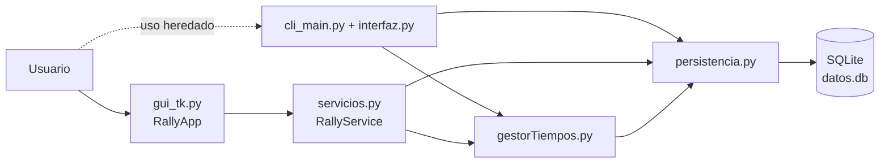
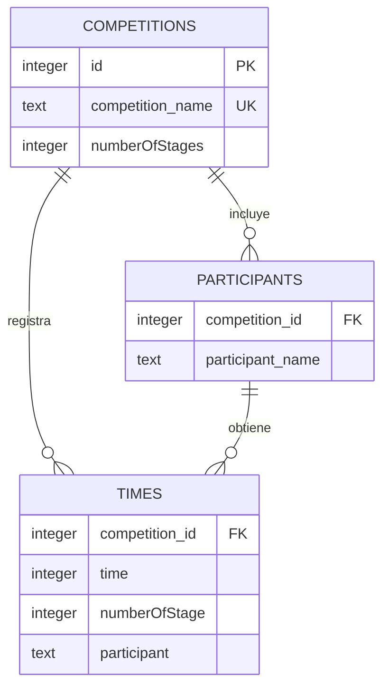

# Arquitectura y modelo de datos

## 1. Visión general

Rally Time Tracker es una aplicación monolítica de escritorio, local y síncrona. Usa únicamente la biblioteca estándar de Python durante la ejecución:

- Tkinter/ttk para la interfaz;
- `sqlite3` para persistencia;
- `os`, `sys` y `ctypes` para rutas e integración con Windows.

No hay proceso servidor, API HTTP, autenticación ni sincronización externa.



La GUI sigue una separación ligera entre presentación, servicios y persistencia. La CLI es anterior a esa separación y llama directamente a persistencia y utilidades.

## 2. Módulos

| Archivo | Responsabilidad | API o elementos principales |
| --- | --- | --- |
| `src/main.py` | Entrada oficial | Importa y ejecuta `gui_tk.main()` |
| `src/gui_tk.py` | Ventana, formularios, tabla, eventos y temas | `RallyApp`, `main()` |
| `src/servicios.py` | Casos de uso, mensajes y validación básica | `RallyService` |
| `src/persistencia.py` | Ruta de datos, esquema y consultas SQLite | altas, bajas, lecturas, tiempos y conteos |
| `src/gestorTiempos.py` | Conversión de unidades y orden de participantes | `tiempo_a_milisegundos`, `milisegundos_a_tiempo`, `orderParticipants` |
| `src/cli_main.py` | Bucle interactivo de consola heredado | código ejecutado a nivel de módulo |
| `src/interfaz.py` | Menús y tabla de texto de la CLI | `menuPrincipal`, `cargarCompeticiones`, `menuCompeticion`, `mostrarDatos` |
| `.github/scripts/release.py` | SemVer, notas y actualización de changelog | cálculo a partir de commits |
| `.github/workflows/release.yml` | CI de publicación | build Windows, commit, tag y GitHub Release |

Los imports de `src` son imports planos, no un paquete Python instalable. Por eso las entradas se ejecutan como archivos desde `src` y no mediante `python -m rally_time_tracker`.

## 3. Estado de la GUI

`RallyApp` mantiene en memoria:

- `service`: instancia de `RallyService`;
- `current_competition`: diccionario de la competición cargada;
- `current_leaderboard`: filas del ranking original;
- `dark_mode` y `theme_colors`: estado visual;
- variables Tkinter de formularios y widgets.

No existe caché de dominio. Después de una escritura correcta, la GUI consulta otra vez SQLite y reconstruye la tabla.

## 4. Modelo de dominio

Una competición tiene:

- identificador entero autoincremental;
- nombre único;
- número de etapas;
- una lista de participantes.

Un tiempo relaciona de forma implícita:

- competición;
- nombre de participante;
- número de etapa;
- duración en milisegundos.

Penalizaciones y abandonos no son entidades independientes. Ambos modifican o crean el valor final del tiempo; no queda registrado el valor original, el motivo ni el autor del cambio.

## 5. Esquema SQLite

El esquema se crea de manera idempotente en cada apertura de conexión:

```sql
CREATE TABLE IF NOT EXISTS competitions (
    id INTEGER PRIMARY KEY AUTOINCREMENT,
    competition_name varchar2(255) UNIQUE,
    numberOfStages int
);

CREATE TABLE IF NOT EXISTS participants (
    competition_id int,
    participant_name varchar2(255),
    foreign key(competition_id) references competiciones(id)
);

CREATE TABLE IF NOT EXISTS times (
    competition_id int,
    time int,
    numberOfStage int,
    participant varchar2(255),
    foreign key(competition_id) references competitions(id)
);
```

Relación conceptual:



Limitaciones estructurales actuales:

- la clave foránea de `participants` referencia por error `competiciones`, una tabla que no existe;
- SQLite no activa `PRAGMA foreign_keys = ON`;
- no hay claves primarias en `participants` ni `times`;
- no hay restricción única para participante por competición ni para tiempo por participante y etapa;
- `times.participant` guarda texto en vez de una clave de participante;
- no hay restricciones `CHECK` para etapas, duraciones o número de etapas;
- no hay índices explícitos para las consultas frecuentes.

La aplicación mantiene parte de la integridad mediante sus funciones, pero una base editada externamente o una llamada fuera de la GUI puede introducir estados no válidos.

## 6. Ubicación e inicialización

`persistencia._get_db_path()` decide la ruta:

```text
¿sys.frozen?
├── sí  -> %LOCALAPPDATA%/RallyTimeTracker/datos.db
└── no  -> <os.getcwd()>/data/datos.db
```

En ambos casos crea el directorio si falta. Cada función abre una conexión, llama a `_initialize_schema`, ejecuta su operación y cierra la conexión.

La base `data/datos_template.db` existente en algunos entornos es una plantilla vacía histórica. El código actual no la copia ni la consulta. El `.spec` local también la menciona, pero el workflow vigente empaqueta mediante argumentos de línea de comandos y crea la base al primer uso.

## 7. Flujos principales

### Crear competición

```text
Formulario GUI
  -> RallyService.create_competition
     -> valida nombre, duplicado, etapas y lista no vacía
     -> persistencia.add_competition
        -> INSERT competitions
        -> SELECT id
        -> INSERT participants, uno a uno
  -> refresco y selección
```

La inserción de competición y participantes usa dos confirmaciones separadas. No hay una transacción explícita que revierta la competición si falla posteriormente un participante.

### Registrar tiempo

`RallyService.add_time_str` convierte `m:ss.xxx` a milisegundos. `persistencia.add_time` busca una fila con la misma competición, etapa y texto de participante:

- si existe, ejecuta `UPDATE`;
- si no, ejecuta `INSERT`.

No se valida en persistencia que el participante pertenezca a la competición ni que la etapa esté dentro del rango configurado.

### Rellenar abandonos

`fill_times` obtiene el mayor tiempo de la etapa, calcula qué participantes no tienen fila e inserta para ellos `peor_tiempo + 10000` milisegundos. Sin tiempo base devuelve `False`.

### Penalizar

`fill_times_penalitation` lee el valor actual y suma `penalty_ms`. Si no encuentra fila devuelve `False`. La actualización pierde la separación entre tiempo original y penalización.

### Eliminar competición

`delete_competition` busca el id y borra manualmente, en una misma confirmación, las filas de `competitions`, `participants` y `times`. No depende de cascadas de claves foráneas.

## 8. Cálculo de clasificación

`orderParticipants` hace una consulta por participante, suma sus tiempos existentes y ordena el total ascendentemente. `RallyService._build_leaderboard` asigna posición, toma el primer total como referencia y calcula diferencias.

Complejidad aproximada para `P` participantes:

- al menos `P` consultas para ordenar;
- otras `P` consultas para construir las columnas;
- coste de ordenación `O(P log P)`.

El patrón es `N+1` y puede hacerse perceptible con muchos participantes.

La consulta `get_times` devuelve solo el valor ordenado por etapa, pero no devuelve el número de etapa. La capa de servicio coloca esos valores por índice. Si falta una etapa intermedia, no puede saber qué hueco debe conservar y desplaza el tiempo. Además, las etapas ausentes no contribuyen al total, por lo que un participante incompleto puede quedar artificialmente delante.

## 9. Presentación

La tabla se reconstruye al cambiar de competición o después de una operación. Sus columnas son dinámicas según el número de etapas y disponen de barras vertical y horizontal.

La ordenación de cabeceras es solo de presentación:

- siempre ascendente;
- los valores ausentes se sitúan al final al ordenar un tramo;
- `Pos` y `Total` ordenan por el total original;
- el campo `rank` no cambia al reordenar filas.

La integración Windows intenta activar DPI awareness, establecer un AppUserModelID y cargar iconos. Todas estas llamadas están protegidas por `try/except`, por lo que su fallo no impide abrir la aplicación.

## 10. Errores, concurrencia y seguridad

La capa de servicio transforma algunos resultados esperados en pares `(éxito, mensaje)`. Los errores de formato más simples se presentan en la barra de estado.

No se capturan de forma general excepciones SQLite, errores de permisos, corrupción del archivo ni fallos inesperados de renderizado. Tampoco hay bloqueo de aplicación única. SQLite serializa escrituras, pero la aplicación no está diseñada para que varias instancias editen simultáneamente la misma competición.

La aplicación no maneja credenciales ni red. Los datos quedan en texto estructurado dentro de un archivo local SQLite, sin cifrado. La protección y copia del archivo dependen del sistema operativo y del usuario.

